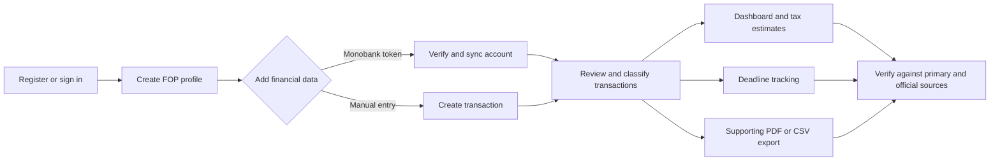
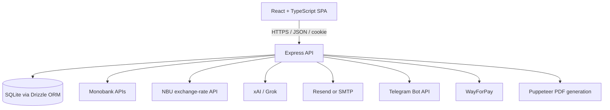

# Kasyr.ai

**Accounting workflow assistant for Ukrainian sole proprietors (FOP).**

Kasyr.ai is an independent functional MVP that explores how a sole proprietor can bring bank transactions, transaction classification, tax estimates, deadline tracking, and accountant-ready exports into one workflow. The repository also serves as a Business Analysis / Systems Analysis case study: the product scope, verified requirements, workflows, system boundaries, and implementation constraints are documented alongside the code.

> Kasyr.ai is an informational tool. It does not submit tax returns, replace official tax records, or provide tax advice. Users must verify calculations, deadlines, payment details, and generated documents against primary records and official Ukrainian sources.

## Portfolio documentation

| Artifact | What it demonstrates |
| --- | --- |
| [Business case](docs/BUSINESS_CASE.md) | Problem framing, users, value, scope, assumptions, and risks |
| [Verified functional requirements](docs/FUNCTIONAL_REQUIREMENTS.md) | Requirements traced to the implemented UI, API, and services |
| [Actual workflows](docs/WORKFLOWS.md) | Implemented user and system flows, including exception paths |
| [System overview](docs/SYSTEM_OVERVIEW.md) | Architecture, data model, integrations, and system boundaries |
| [Roadmap](docs/ROADMAP.md) | Product gaps and next development priorities |
| [Official sources checklist](docs/OFFICIAL_SOURCES_UA.md) | Sources used when tax rules and constants need review |
| [Tax configuration guide](docs/TAX_CONFIG_UPDATE_GUIDE.md) | Maintenance process for annual tax configuration |

## Product at a glance

**Primary user:** a Ukrainian FOP who needs a consolidated view of incoming transactions, estimated tax obligations, and reporting deadlines.

**Core problem:** relevant data is distributed across bank statements, manual notes, tax calendars, and official services. Reconciliation and preparation for an accountant require repeated manual work and create a risk of omissions.

**MVP response:** connect a Monobank account or add transactions manually, review their classification, calculate indicative obligations from a tax profile, track generated deadlines, and export supporting PDF/CSV documents.

## Verified capabilities

| Area | Implemented behavior | Important constraint |
| --- | --- | --- |
| Account access | Email/password registration and login, email verification, signed authentication cookie, optional Google OAuth | Email and OAuth depend on environment configuration; password reset is not implemented |
| FOP onboarding | Tax ID, registration date, tax group 1–3, VAT status for group 3, local EP rate for groups 1–2, and KVEDs | Profile data is entered by the user; there is no government-register verification |
| Bank connection | Monobank token verification, encrypted token storage, account connection, manual and scheduled synchronization | Only Monobank is implemented; the first import is limited to the API's 31-day statement window |
| Transactions | Bank import with duplicate checks, manual entry, search, category filtering, editing, and per-transaction classification | Imported amounts and classifications must be reconciled with primary documents |
| Classification | Local rule-based classification with optional Grok classification and a daily per-user AI quota | Rules remain the fallback when the AI key is absent, the provider fails, or quota is exhausted |
| Dashboard | Income summary, estimated EP/ESV/VZ, income chart, recent transactions, next deadline, and exchange rates | Calculations use application constants and selected categories; they are not official liabilities |
| Deadlines | Tax-profile-based generation for current/selected years, status tracking, email reminders, and optional Telegram reminders | Dates are code-configured and require periodic legal review |
| Reports and export | Supporting quarterly PDF, income-book PDF, and UTF-8 CSV export for an accountant | PDFs are not submitted to the State Tax Service; the income-book amount formatting has a known unit defect |
| Plans and payment | Free/Pro/Business plan definitions and a WayForPay checkout/webhook path | Access control is in beta mode and is not consistently enforced across all features |
| Support | FAQ, authenticated feedback form, and AI-assisted help with deterministic fallback answers | Help content is informational and not professional tax advice |

The requirement-level traceability and implementation evidence are in [docs/FUNCTIONAL_REQUIREMENTS.md](docs/FUNCTIONAL_REQUIREMENTS.md).

## Core workflow



## Explicit MVP boundaries

- The application does **not** file declarations or make tax payments.
- Generated PDFs are supporting documents, not official declarations.
- VAT obligations and tax credit are not calculated automatically.
- Tax constants and deadline rules are maintained in code and must be reviewed when legislation changes.
- Only Monobank is connected; other banks shown in the UI are marked as future options.
- Bank data, classifications, and estimates require user review against primary documents.
- Subscription logic exists, but the repository currently enables beta/full-access behavior in parts of the backend.

## Architecture



See [docs/SYSTEM_OVERVIEW.md](docs/SYSTEM_OVERVIEW.md) for component responsibilities, data entities, trust boundaries, and integration behavior.

## Technology

- Frontend: React, TypeScript, Vite, Zustand, React Router, Recharts, Tailwind CSS
- Backend: Node.js, Express, TypeScript
- Data: SQLite, Drizzle ORM
- Integrations: Monobank, NBU, xAI/Grok, Telegram, Resend/SMTP, Google OAuth, WayForPay
- Documents: Puppeteer-generated PDF and CSV export

## Local setup

Prerequisites: Node.js and npm.

```bash
git clone https://github.com/mazurenkodmytro0710/kasyr.ai.git
cd kasyr.ai
npm install
cp .env.example .env
npm run dev
```

- Frontend: `http://localhost:5173`
- API: `http://localhost:3001`
- API health check: `http://localhost:3001/api/health`

For a local Monobank walkthrough, enter `demo-token` during the connection step. This uses deterministic demo data and does not call Monobank. Real personal tokens are also supported through the Monobank Personal API.

Email, Google OAuth, Telegram, AI, and WayForPay are optional integrations. Their environment variables are documented in [.env.example](.env.example); never commit real credentials.

## Useful commands

```bash
npm run dev          # client and API in watch mode
npm run build        # type-check and build the frontend
npm run lint         # ESLint checks
npm run db:seed      # seed local demo accounts and data
npm run db:studio    # inspect the local database
```

The API initializes the required SQLite tables on startup. The default local database file and environment files are excluded from Git.

## Security and data handling

- Passwords are hashed with bcrypt.
- Authentication is accepted through a signed, HTTP-only cookie or bearer token.
- Monobank tokens are encrypted with AES-256-GCM before persistence and are not returned by the accounts API.
- Auth, bank connection/sync, and feedback endpoints have rate limits.
- Helmet, a CORS allowlist, input length limits, and ownership checks in route queries provide baseline API protection.
- Local `.env`, SQLite files, logs, and build artifacts are ignored by Git.

This is an MVP, not a production security certification. Production deployment requires strong unique secrets, restricted origins, secret rotation, access-control hardening, backup/retention rules, and a dedicated security review.

## Repository structure

```text
src/                 React application, pages, state, and API clients
server/routes/       Express API endpoints
server/services/     Tax, bank sync, AI, PDF, email, and Telegram logic
server/db/           SQLite schema and initialization
docs/                BA/SA artifacts and domain-maintenance notes
```

## Verification status

The repository was reviewed against the implementation rather than promotional copy. At the time of the documentation update:

- `npm run build` completed successfully;
- `npm run lint` completed successfully;
- no tracked `.env`, database, private-key, or certificate file was found;
- local environment values were not copied into the documentation.
