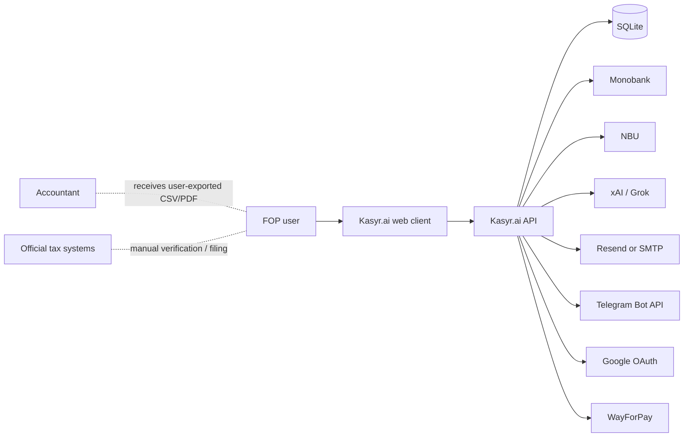
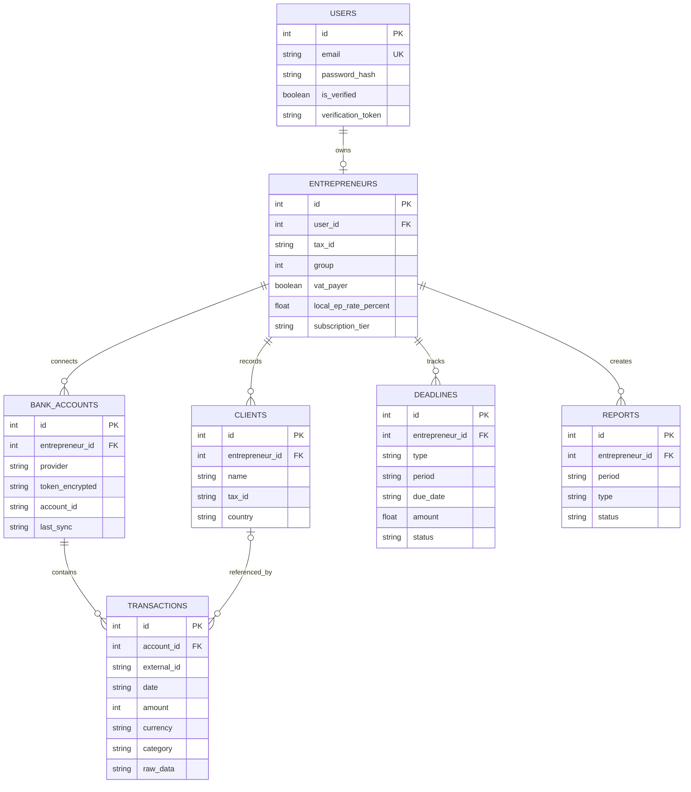

# System Overview

## 1. System context

Kasyr.ai is a React single-page application backed by an Express API and SQLite database. The API owns authentication, profile and transaction access, calculations, deadline generation, exports, and integration calls.

Official tax systems and the accountant are outside the software boundary. The application neither transmits filings to them nor receives authoritative liability data from them.

## 2. Component responsibilities

| Component | Responsibility |
| --- | --- |
| React client (`src/`) | Navigation, onboarding, dashboards, forms, local UI state, downloads, and responsive presentation |
| Express API (`server/routes/`) | Authentication, validation, ownership scoping, orchestration, and HTTP responses |
| Domain services (`server/services/`) | Tax calculations, deadline generation, bank sync, classification, PDF rendering, notifications, and exchange rates |
| SQLite/Drizzle (`server/db/`) | Local persistence and schema access |
| Cron jobs (`server/index.ts`) | Four-hour bank sync, daily deadline reminders, and subscription-expiry warnings |
| External providers | Bank data, exchange rates, optional AI, email, Telegram, OAuth, and checkout |

## 3. Data model

The schema expresses one user-to-one entrepreneur in application logic, although the database table does not declare `entrepreneurs.user_id` unique.

## 4. API surface

| Prefix | Main responsibility |
| --- | --- |
| `/api/auth` | Register, verify, resend verification, login, session, logout, Google OAuth |
| `/api/entrepreneur` | FOP profile, tax profile, clients, preferences, Telegram link |
| `/api/bank` and `/api/monobank` | Connect, list, disconnect, and synchronize Monobank |
| `/api/transactions` | List, create, view, update, and classify owned transactions |
| `/api/dashboard` | Summary and income-series projections from stored data |
| `/api/deadlines` | List and update generated deadlines |
| `/api/reports` | Report metadata and supporting PDFs |
| `/api/exports` | Accountant CSV |
| `/api/help` and `/api/feedback` | Help chat and feedback submission |
| `/api/subscription` | Plans, checkout payload, and payment webhook |
| `/api/telegram` | Telegram link state and disconnect |

## 5. Integration behavior

| Integration | Direction | Authentication/data | Failure behavior |
| --- | --- | --- | --- |
| Monobank Personal API | Outbound | User token in `X-Token`; encrypted at rest | Explicit invalid/rate-limit responses; scheduled sync logs failures |
| Monobank currency API | Outbound | Public endpoint | One-hour cache; stale cache on provider rate limit when available |
| NBU exchange API | Outbound | Public endpoint and date/currency | In-memory cache; request error propagated to API handler |
| xAI/Grok | Outbound | Server API key; transaction/help prompt | Local deterministic fallback and per-user daily quota |
| Resend/SMTP | Outbound | Server credentials | Falls back to console/log mode when unconfigured |
| Telegram | Bidirectional bot polling | Bot token and per-user link token | Integration is disabled when token/username is absent |
| Google OAuth | Redirect/callback | OAuth client credentials | Returns unavailable/error path when unconfigured or failed |
| WayForPay | Outbound checkout + inbound webhook | Merchant credentials and signature | Checkout unavailable without credentials; beta entitlement update on approved event |

## 6. Trust boundaries and sensitive data

Sensitive data includes password hashes, tax IDs, bank tokens, bank account identifiers, transaction descriptions, raw Monobank payloads, notification identifiers, and third-party credentials.

- Browser input is untrusted; the API performs basic validation and sanitization.
- Authentication uses a signed HTTP-only cookie, with bearer-token compatibility.
- User-scoped queries normally derive the entrepreneur/account set from the authenticated user.
- Monobank tokens are encrypted with AES-256-GCM using a key derived from `JWT_SECRET`.
- Local `.env`, SQLite/WAL files, logs, build output, and dependencies are ignored by Git.
- External AI receives transaction descriptions/amounts or help questions when enabled. This is a data-sharing decision that needs user-facing consent and a privacy policy before production use.

## 7. Operational characteristics

- Database initialization is executed at API startup and adds missing columns for the MVP schema.
- No durable background-job queue is used; cron jobs run in the API process.
- Provider caches and AI quota counters are in memory and reset when the process restarts.
- SQLite is a single-file store; backup, retention, encryption-at-rest, and concurrent scaling are deployment concerns.
- Security events are written to local daily JSON-lines log files.
- The frontend and API can be served together in production or run separately in development.

## 8. Known system limitations

- Subscription enforcement is incomplete: beta full-access flags exist, new profiles default to Business, and the plan middleware is not applied to all relevant routes.
- The preferences API accepts a requested subscription tier and therefore must be hardened before paid use.
- Production startup does not fail when `JWT_SECRET` or `COOKIE_SECRET` is absent; development fallback values exist.
- Email verification tokens do not have an expiry field enforced by the verification route.
- The standalone server build currently fails because `tsconfig.server.json` uses `NodeNext` while internal ESM imports omit explicit output extensions; development execution through `tsx` is unaffected.
- The income-book PDF treats stored whole-hryvnia amounts as minor units and divides them by 100 again; this document must not be relied on until the unit conversion is corrected and regression-tested.
- The deadline/tax model is code-configured and is not independently validated by an official service.
- There is no automated test suite in `package.json`; build and lint are the available repository checks.
- Financial amounts and generated documents need dedicated end-to-end reconciliation tests before production use.
