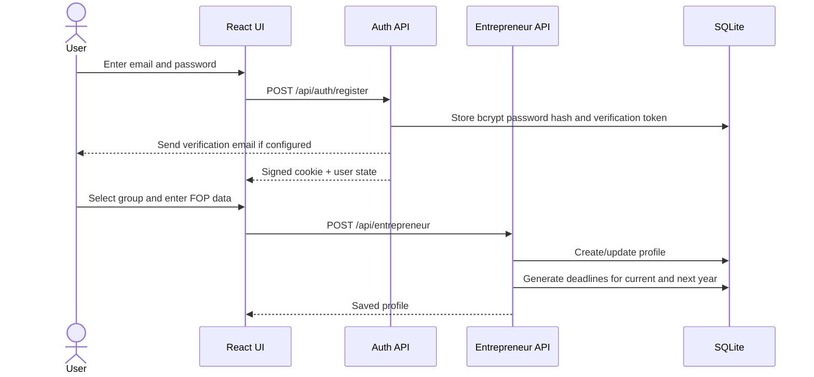
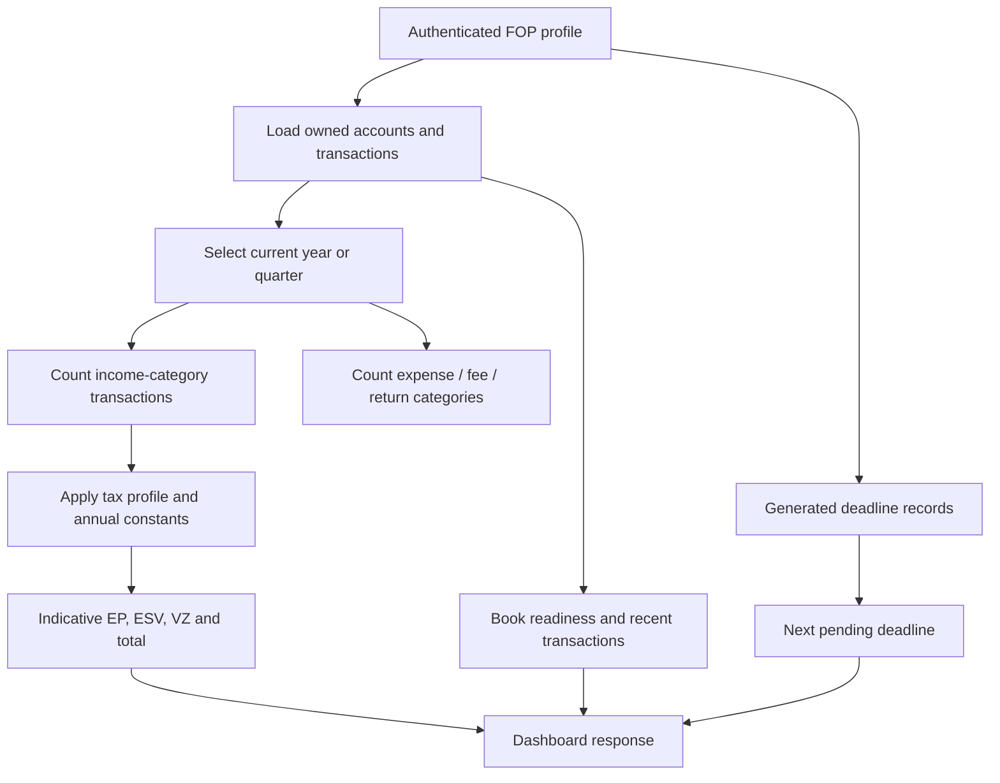
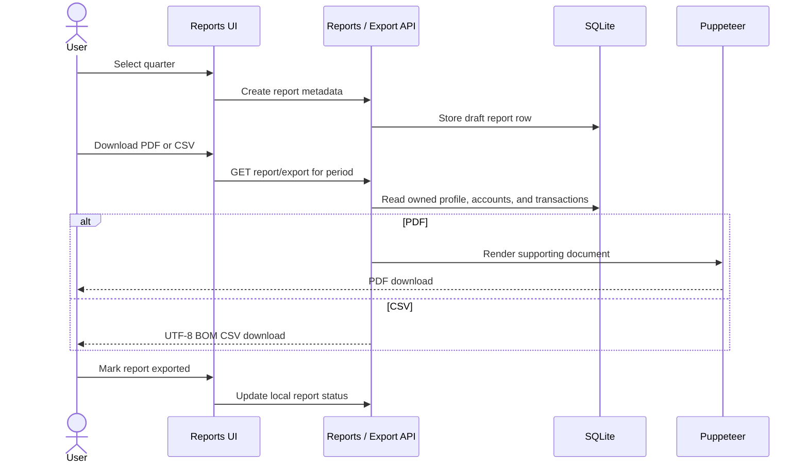

# Actual Workflows

The workflows below are reconstructed from the current React pages, API routes, database queries, and scheduled jobs. They describe implemented behavior, including fallbacks and constraints.

## 1. Registration and FOP onboarding



**Preconditions:** a unique email and valid password. A protected workspace additionally requires a verified account unless verification is disabled for the environment.

**Validation:** group 1–3, ten-digit tax ID, registration date, and group-specific VAT/local-rate rules.

**Exception paths:** duplicate email, invalid password/profile data, unavailable email provider, or unconfigured Google OAuth.

## 2. Monobank connection and synchronization

```mermaid
sequenceDiagram
    actor User
    participant UI as Settings / Onboarding
    participant API as Bank API
    participant Mono as Monobank API
    participant Classifier as Classifier
    participant DB as SQLite

    User->>UI: Enter personal token
    UI->>API: POST /api/bank/connect
    API->>Mono: Verify token and read accounts
    Mono-->>API: Client and account data
    API->>DB: Store selected account and encrypted token
    UI->>API: POST /api/bank/sync
    API->>Mono: Request statement, maximum 31 days
    loop New external transaction IDs
        API->>Classifier: Rules; optionally AI within quota
        Classifier-->>API: Category
        API->>DB: Insert transaction and raw provider payload
    end
    API-->>UI: Number of inserted transactions
```

**Demo path:** tokens starting with `demo` or `mock` return local demo client and statement data without calling Monobank.

**Duplicate rule:** the pair of stored account and Monobank external transaction ID is checked before insert.

**Scheduled path:** every four hours the server synchronizes stored Monobank accounts. Scheduled sync uses local classification rules and does not spend AI quota.

**Exceptions:** invalid token, provider rate limit, no available account, missing entrepreneur profile, or disconnected account.

## 3. Manual transaction and review

1. The user opens the add-transaction modal.
2. The UI sends date, absolute amount, description, optional category/client/comment to `POST /api/transactions`.
3. The server creates a hidden manual account for the entrepreneur when required.
4. If the transaction is unclassified and the current beta/tier path allows it, the server tries AI classification within quota; otherwise it applies local rules.
5. The user can search/filter the list, open details, and update category, client reference, or comment.
6. Dashboard totals and exports read the persisted categories, so review directly affects downstream results.

## 4. Dashboard and tax estimate



The result is operational guidance, not an official liability. Categories, profile data, annual constants, and primary documents must be checked before action.

## 5. Deadline generation and reminders

1. Profile creation or tax-profile change generates/reconciles deadline rows for selected years.
2. Final statuses (`paid` or `submitted`) are preserved during reconciliation.
3. New historical deadlines are inserted as paid to avoid presenting a new user with inherited overdue items.
4. The deadline page filters upcoming, overdue, and completed records and lets the user mark an item paid.
5. At 09:00 server time, a daily job selects pending deadlines due within seven days.
6. On 7, 3, 1, or 0 days remaining, it sends email and/or Telegram reminders according to saved preferences and configured providers.

## 6. Supporting report and accountant export



“Submitted/exported” is an internal tracking status. No route sends a declaration to the State Tax Service.

## 7. Subscription checkout

1. The user selects Pro or Business in Settings when the subscription UI is enabled.
2. The API builds a WayForPay checkout payload when merchant credentials exist.
3. WayForPay posts an event to the webhook.
4. The API verifies the configured signature and, for an approved event, sets the tier and a 30-day expiry.

This is a beta workflow. New profiles currently receive Business access, export/classification paths contain beta full-access flags, and the plan middleware is not consistently applied. It should not be represented as production-grade entitlement enforcement.

